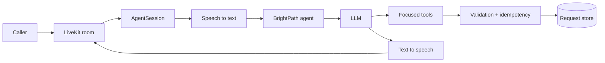

# BrightPath LiveKit Voice Agent

A production-oriented customer deployment reference built with the
[LiveKit Agents SDK](https://docs.livekit.io/agents/). The agent acts as the
voice receptionist for a fictional consulting company: it answers grounded
business questions, checks consultation availability, and captures callback
requests through a retry-safe persistence boundary.

This repository is an active engineering project, not a claim that the sample
business is running in production. The current implementation focuses on the
reliability boundary around agent tool calls. Telephony, a shared production
database, simulations, and deployment measurements are planned next.

## What it demonstrates

- A LiveKit room-based voice session using a cascaded STT, LLM, and TTS
  pipeline through LiveKit Inference.
- LiveKit turn detection, preemptive generation, adaptive interruptions, and
  background voice cancellation.
- Focused, speech-friendly tools for business information, availability, and
  callback capture.
- Input normalization and validation before a side effect is attempted.
- A deterministic idempotency key so at-least-once tool execution does not
  create duplicate callback requests.
- An uninterruptible write boundary, a five-second timeout, and actionable
  `ToolError` responses.
- A concurrency-safe in-memory adapter and a durable SQLite development
  adapter protected by a database uniqueness constraint.
- Deterministic unit tests plus optional LiveKit Cloud behavior evaluations.

## Architecture



Every callback request is normalized and converted to a stable SHA-256 request
identifier derived from the LiveKit session, normalized phone number, and
request. The store performs an atomic create. A replay returns the existing
outcome instead of applying the side effect twice.

SQLite is deliberately limited to local development. It survives a process
restart on one machine, but it is not shared across LiveKit worker containers.
A horizontally scaled deployment must provide a shared PostgreSQL or DynamoDB
adapter that implements the same `ConsultationRequestStore` contract.

## Project structure

```text
src/
  agent.py            LiveKit server, session configuration, and tools
  consultations.py    Validation, idempotency, and persistence adapters
tests/
  test_agent.py        Tool and optional model-behavior tests
  test_consultations.py
```

## Run locally

Prerequisites:

- Python 3.10 through 3.14
- [uv](https://docs.astral.sh/uv/)
- A [LiveKit Cloud](https://cloud.livekit.io/) project

Install dependencies:

```bash
uv sync
```

Create `.env.local` from `.env.example` and supply your own LiveKit Cloud
credentials. `.env.local` is ignored by Git and must never be committed.

To persist callback requests locally between restarts, optionally set:

```text
BRIGHTPATH_DB_PATH=.local/brightpath.db
```

Run the agent in the terminal:

```bash
uv run python src/agent.py console
```

Connect the agent to a LiveKit Cloud project during development:

```bash
uv run python src/agent.py dev
```

Run with production server behavior and graceful shutdown:

```bash
uv run python src/agent.py start
```

## Verification

Credential-free deterministic tests:

```bash
uv run pytest -m "not livekit"
```

The reliability suite includes concurrent retries, restart recovery,
normalization, validation, tool-level deduplication, and database persistence.

With valid LiveKit Cloud credentials, run the complete suite, including model
behavior evaluations:

```bash
uv run pytest
```

Lint and formatting checks:

```bash
uv run ruff check src tests
uv run ruff format --check src tests
```

## Security and privacy

- Credentials belong only in `.env.local` or a deployment secret store.
- Raw caller data is not interpolated into application log messages.
- Room names and participant identities should never contain personal data.
- SQLite is a development convenience, not a production data or compliance
  design.
- A production deployment should configure retention, encryption, access
  control, and LiveKit observability/PII settings for its jurisdiction.

## Roadmap

- Structured intake using LiveKit tasks and correction-aware workflows.
- Authoritative calendar booking with concurrency control and idempotency.
- Shared DynamoDB or PostgreSQL persistence for horizontally scaled workers.
- Inbound SIP, DTMF handling, and human warm transfer.
- Deterministic text and degraded-audio simulations with final-state grading.
- OpenTelemetry/session metrics and measured end-to-end latency percentiles.
- A web frontend, LiveKit Cloud deployment, runbook, and architecture report.

## License

MIT
